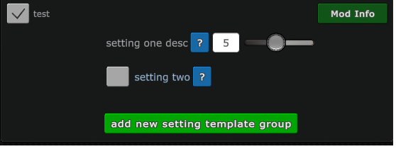
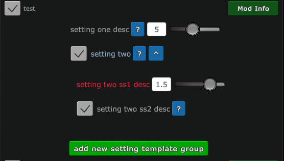
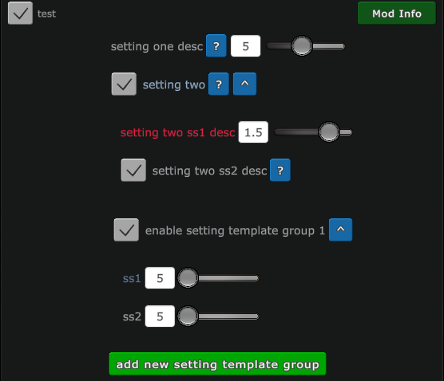
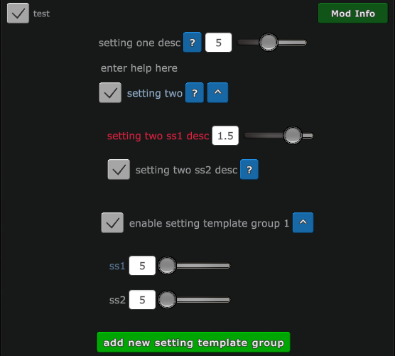
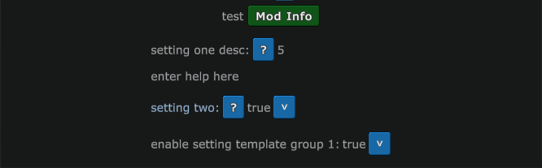
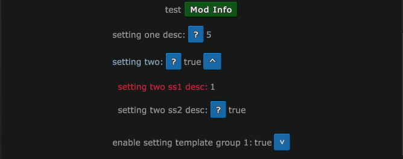
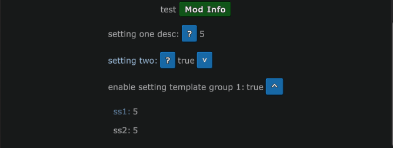

The goal of this is to automatically generate the Client_PresentConfigureUI, Client_SaveConfigureUI and Client_PresentSettingsUI Lua files. All files other than __settings.lua are not meant to be edited. __settings.lua is where to define settings.
# __settings.lua
The file must have a `getSetting` function. returns array of `setting`. `setting` is a table which is generated from the `addSetting`, `addSettingTemplate` and `addCustomCard` functions
## addSetting
* `name` - string - name of the setting. all names must be unique to function correctly
* `label` - string - summery of what the setting does
* `inputType` - string - one of `'int'`, `'float'`, `'bool'`, `'text'` or `'radio'`
* `defaultValue` - same type as `inputType` - the default value for the setting's value in Client_PresentConfigureUI
* `otherProps` - table or nil - if table then these keys are optional:
  * `help` - `function(parent)` - gives a more detailed explanation of what the setting does when a help button (?) is clicked
  * `labelColor` - string - color of the setting's label
  * `bkwards` - same type as what is used in `defaultValue` or nil - the value to use in setting menus if Mod.Settings\[`name`\] is `nil`
### inputType
Depending on the `inputType` certain keys on `otherProps` are forced and some become optional
#### int
Forced keys:
* `minValue` - number - the lowest the setting's value can be
* `maxValue` - number - the highest the setting's value can be while using the setting slider
Optional keys:
* `absoluteMax` - number - allows user to enter a higher number than `maxValue`
* `absoluteMin` - number - allows user to enter a lower number than `minValue`
#### float
Forced keys:
* `dp` - number - the number of decimal places to round the setting's value when saving the settings
* `minValue` - number - the lowest the setting's value can be
* `maxValue` - number - the highest the setting's value can be while using the setting slider
Optional keys:
* `absoluteMax` - number - allows user to enter a higher number than `maxValue`
* `absoluteMin` - number - allows user to enter a lower number than `minValue`
#### bool
Optional keys:
* `subsettings` - nil or array of `setting`
#### text
Optional keys:
* `placeholder` - string - the placeholder text
* `charLimit` - number - the maximum number of characters that can be entered
### radio
This makes a group of radio buttons (or checkboxes if radio buttons are not supported) where only one option can be checked at any time. `defaultValue` and `otherProps.bkwards` (if specified) must be a number index that can be indexed by `controls`. `defaultValue` becomes the initial checkbox to check. The value of the setting is saved as the index of the currently selected `control`.

Forced keys:
* `controls` - array of `control` - details about the checkbox listed under `label`

`control` - string (treated as table with key `label`) or table with keys:
* `label` - string - summary of what the radio button does
* `labelColor` - string or nil - color of `label` text
* `help` - `function(parent)` or nil - gives a more detailed explanation of what the radio button does when a help button (?) is clicked
## addSettingTemplate
In the event of wanting to have infinite groups of settings, setting templates can be used. The value of the setting is set to the number of template items there are. Template items follow the naming pattern "`name`_`n`" when their values are written to `Mod.Settings`. Any `settings` in template items should use `n` in their `name` to uniquely identify them.

Arguments:
* `name` - string - name of the setting. All names must be unique to function correctly
* `btnText` - string - text that goes on a button that user presses to add a new group of settings
* `options` - nil or table with keys:
  * `btnColor` - nil or string - color of the button; nil = #00FF05
  * `btnTextColor` - nil or string - color of `btnText`; nil = wz default
  * `bkwrds` - nil or int - for if the mod is public and goes from limited to unlimited amounts of setting groups. `bkwrds` number of setting groups will be generated. to avoid nil in Client_PresentSettingsUI
* `get(n)` - `function(n)` - `n` starts at 1. `get` must return a table with keys:
  * `label` - string - description of the setting group
  * `labelColor` - nil or string - color of the label; nil = wz default
  * `settings` - array of `setting`
## addCustomCard
For use on [Custom Cards](https://www.warzone.com/wiki/Mod_API_Reference:Custom_Cards).

If while configuring or saving mod settings and the game creator's app version does not fully support custom cards, settings for custom cards will not be configurable or saved. A message in Client_PresentConfigureUI.lua will notify them that their app version does not support custom card and to upgrade app version. The game may still be created. This can be prevented if a mod uses [Client_CreateGame](https://www.warzone.com/wiki/Mod_Hooks).

Arguments:
* `name` - string - used to store the CardID from `addCard`. All names must be unique to function correctly
* `customCardName` - string - name of the card - used for `addCard`
* `customCardDescription` - string - description of the card - used for `addCard`
* `customCardImageFilename` - string - image filename - used for `addCard`
* `cardGameSettingsMap` - table - must have fields `NumPieces`, `MinimumPiecesPerTurn`, `InitialPieces` and `Weight`. Has optional fields `ActiveOrderDuration` (defaults to `-1`) and `ActiveCardExpireBehavior`. If the value of a field is a number, that value will be used as-is. If the value of a field is a string, it must be a setting `name` and the value of `Mod.Settings[name]` will be used. If `ActiveOrderDuration` is falsey, `ActiveOrderDuration` will be changed to `-1` and `ActiveCardExpireBehavior` will be changed to `nil`. `cardGameSettingsMap` is applied after all settings have been written to `Mod.Settings`.  - used for `addCard`
* `settings` - nil or array of `setting` - all card settings, including completely custom settings
# Accessing setting values
Each setting is written to `Mod.Settings[name]`. The `getSetting(name)` function defined in `settings.lua` returns the value stored in `Mod.Settings[name]`. If the value is `nil`, a message will printed. `name` is the same as what is used in `addSetting`, `addSettingTemplate` or `addCustomCard`.
# Examples
* [code/__settings.lua](https://github.com/DanWaLes/Warzone/blob/main/mods/libs/AutoSettingsFiles/code/__settings.lua)
* [AIs don't attack](https://github.com/DanWaLes/Warzone/tree/main/mods/AIs%20dont%20attack/__settings.lua)
* [Advanced Card Distribution (per player)](https://github.com/DanWaLes/Warzone/tree/main/mods/Advanced%20Card%20Distribution%20per%20player/__settings.lua)
* [Custom Card Package 2](https://github.com/DanWaLes/Warzone/tree/main/mods/Custom%20Card%20Package%202/__settings.lua)
* [Mystery Card](https://github.com/DanWaLes/Warzone/tree/main/mods/Mystery%20Card/__settings.lua)
* [Random settings generator](https://github.com/DanWaLes/Warzone/tree/main/mods/Random%20settings%20generator/__settings.lua)
* [Surveillance Card+](https://github.com/DanWaLes/Warzone/tree/main/mods/Surveillance%20Card%2B/__settings.lua)
* [Swap Territories 2](https://github.com/DanWaLes/Warzone/tree/main/mods/Swap%20Territories%203/__settings.lua)
* [Wastelands+](https://github.com/DanWaLes/Warzone/tree/main/mods/Wastelands%2B)
## Screenshots
### Client_PresentConfigureUI.lua

### Client_PresentSettingsUI.lua

